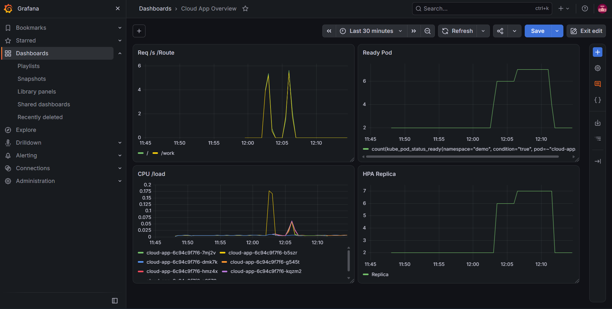

# Platform Cloud-Native di Kubernetes

Proyek portofolio untuk mempelajari cara membangun, menjalankan, dan menguji ketahanan sebuah platform cloud-native: aplikasi dikemas dalam container, dijalankan di Kubernetes dengan autoscaling, dipantau secara real time, dan dideploy otomatis lewat pipeline GitOps.

Aplikasinya sengaja sederhana. Yang dipelajari adalah **infrastruktur di sekitarnya**.

## Tujuan Belajar

- Memahami siklus penuh: kode, image, registry, cluster, monitoring
- Membuktikan sifat sistem terdistribusi secara nyata: replikasi, deteksi kegagalan, penjadwalan ulang, dan penskalaan
- Mengukur ketahanan lewat chaos test, bukan hanya mengklaimnya

## Arsitektur

```
Developer
   |  git push
   v
GitHub  --->  GitHub Actions (build image, push ke GHCR, ubah tag di k8s/deployment.yaml)
   |
   |  ArgoCD menarik perubahan dari Git (GitOps)
   v
Kubernetes (k3d: 1 server + 2 agent)
   Traefik Ingress --> Service --> Pod cloud-app (2 sampai 8, diatur HPA)
   Prometheus (scrape /metrics) --> Grafana (dashboard)
```

## Teknologi

| Komponen | Fungsi |
|---|---|
| Node.js + Express | Aplikasi contoh dengan endpoint `/`, `/work`, `/health`, `/metrics` |
| Docker | Mengemas aplikasi menjadi image |
| k3d (k3s) | Cluster Kubernetes multi-node di dalam container Docker |
| Traefik | Ingress, pintu masuk HTTP ke cluster |
| HPA | Menambah atau mengurangi pod berdasarkan CPU |
| Prometheus + Grafana | Mengumpulkan dan menampilkan metrik |
| GitHub Actions + GHCR | CI: build dan simpan image |
| ArgoCD | CD berbasis GitOps: menyamakan cluster dengan isi Git |

## Struktur Repo

```
app/        Kode aplikasi dan Dockerfile
k8s/        Manifest: Deployment, Service, Ingress, HPA, ServiceMonitor
argocd/     Definisi Application ArgoCD
terraform/  (opsional) Infrastruktur AWS sebagai kode
docs/       Screenshot dan bukti uji
.github/    Workflow CI
```

## Cara Menjalankan dari Nol

Prasyarat: WSL2 (Ubuntu), Docker Engine, kubectl, k3d, helm. RAM disarankan 8 GB atau lebih.

```bash
# 1. Cluster
k3d cluster create cloudnative --agents 2 -p "8080:80@loadbalancer"

# 2. ArgoCD
kubectl create namespace argocd
kubectl apply -n argocd --server-side --force-conflicts \
  -f https://raw.githubusercontent.com/argoproj/argo-cd/stable/manifests/install.yaml

# 3. Monitoring
helm repo add prometheus-community https://prometheus-community.github.io/helm-charts
helm repo update
helm install monitoring prometheus-community/kube-prometheus-stack \
  -n monitoring --create-namespace --set alertmanager.enabled=false

# 4. Aplikasi (tunggu langkah 2 dan 3 selesai; ArgoCD mengambil manifest dari repo ini)
kubectl apply -f argocd/application.yaml

# 5. Uji
curl localhost:8080
```

Akses UI lewat port-forward:

```bash
kubectl port-forward -n monitoring svc/monitoring-grafana 3002:80
kubectl port-forward -n argocd svc/argocd-server 8081:443
```

## Alur Kerja (GitOps)

1. Ubah kode lalu `git push`.
2. GitHub Actions membangun image, memberi tag SHA commit, mengirimnya ke GHCR, dan mengubah tag di `k8s/deployment.yaml`.
3. ArgoCD mendeteksi perubahan di Git dan menjalankan rolling update.
4. Kalau ada yang mengubah cluster secara manual, ArgoCD mengembalikannya (self-heal).

## Konsep Penting

| Konsep | Penjelasan singkat | Di proyek ini |
|---|---|---|
| Stateless | Aplikasi tidak menyimpan data di dalam pod, jadi pod bebas dibuat atau dihapus | Semua pod identik |
| Desired state | Kita menyatakan kondisi yang diinginkan, controller terus memperbaiki selisihnya | Deployment menjaga jumlah pod |
| Rolling update | Pod baru siap dulu, baru pod lama dimatikan | `maxUnavailable: 0` |
| Readiness vs liveness | Readiness: boleh menerima traffic. Liveness: perlu di-restart | Keduanya ke `/health` |
| Requests vs limits | Jatah minimum untuk penjadwalan vs batas maksimum | HPA menghitung persen dari request |
| HPA | `replika baru = ceil(replika sekarang x CPU saat ini / target)` | Target CPU 50% |
| GitOps | Git sebagai sumber kebenaran tunggal | ArgoCD, `prune` dan `selfHeal` |
| Pull vs push deploy | Cluster menarik dari Git, CI tidak butuh akses ke cluster | Lebih aman |
| Observability | Memahami sistem dari metrik | Prometheus dan Grafana |
| Tag SHA | Setiap versi image bisa dilacak dan di-rollback | Bukan `latest` |

Catatan desain: field `replicas` sengaja tidak ditulis di Deployment karena jumlahnya dikendalikan HPA. Kalau ditulis, ArgoCD dan HPA akan saling berebut.

## Hasil Uji

> Semua angka diukur langsung pada cluster lokal (k3d, 3 node). Isi sesuai hasil Anda.

### Self-healing dan ketahanan

| Skenario | Hasil | Waktu pulih |
|---|---|---|
| Hapus 1 pod | ISI (request gagal dari total) | pod pengganti siap sekitar 7 detik |
| Hapus semua pod sekaligus | ISI | pod pengganti siap sekitar 8 detik |
| Drain 1 node | ISI | ISI |
| Node mati mendadak | ISI | ISI (pod dijadwalkan ulang setelah masa toleransi 5 menit) |
| Deploy image salah | ISI (pod lama tetap melayani) | ISI (dikembalikan ArgoCD) |
| Ubah image manual | Dikembalikan ArgoCD | ISI |
| Rollback lewat `git revert` | Versi kembali | ISI |

### Autoscaling

| Metrik | Hasil |
|---|---|
| Replika awal | 2 |
| CPU saat beban | 64% dari target 50% (2 replika, dihitung `ceil(2 x 64/50) = 3`) |
| Replika puncak | sekitar 7 dari maksimum 8 |
| Waktu sampai replika turun lagi | ISI (diperkirakan sekitar 5 menit) |

### Bukti




## Masalah yang Saya Temui dan Solusinya

| Masalah | Penyebab | Solusi |
|---|---|---|
| `permission denied` di docker.sock | Docker Desktop tidak terhubung ke WSL | Pasang Docker Engine langsung di WSL dan tambahkan user ke grup `docker` |
| `git push` ditolak password | GitHub tidak lagi menerima password akun | `gh auth login` atau token |
| Image GHCR gagal dibuat | Nama image harus huruf kecil | Workflow mengubah nama repo ke huruf kecil |
| Pull image sangat lambat atau gagal DNS | Tiap node mengunduh sendiri, jaringan node rapuh | `docker pull` di laptop lalu `k3d image import` |
| `address already in use` di port 8080 | Sisa container atau `docker-proxy` yatim | Cari lewat `ss`, hapus container sisa, atau ganti port |
| `helm install` ditolak | Nama release sudah dipakai | Cukup tunggu, atau pakai `helm upgrade` |
| Cluster hilang setelah restart | Resource Docker ter-reset | Dibangun ulang dari kode, aplikasi kembali dari Git |

## Keterbatasan

- Control plane hanya satu node, sehingga menjadi single point of failure
- Tidak ada HTTPS dan tidak ada penyimpanan permanen untuk Prometheus dan Grafana
- Secret belum dikelola khusus
- Berjalan di cluster lokal, bukan multi-zona di cloud

## Rencana Pengembangan

- k3s HA dengan 3 server, cert-manager untuk HTTPS, dan Sealed Secrets
- Alerting di Grafana, dashboard disimpan sebagai kode di repo
- Infrastruktur AWS lewat Terraform
- PodDisruptionBudget dan penyimpanan persisten
- Menjalankan layanan inference AI di atas platform ini untuk meneliti penskalaan dan penjadwalan resource

## Penulis

ISI nama dan kontak.